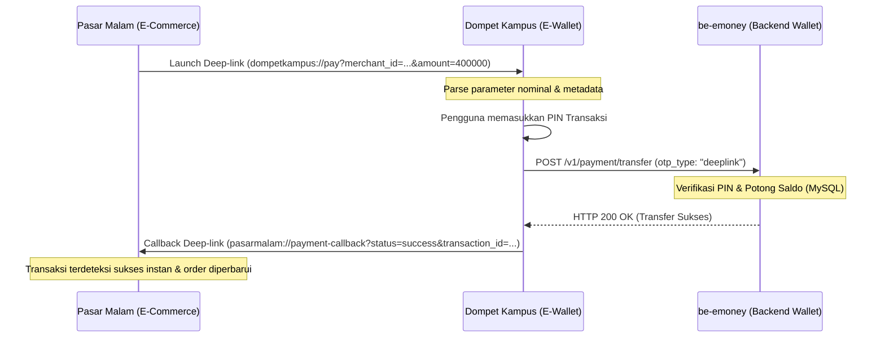

# 💳 Dompet Kampus Global - E-Wallet Application

### 👤 Identitas Mahasiswa
- **Nama:** Aditya Maula Wiratama
- **NIM:** 1123150013
- **Kelas:** TI SE 1


[](https://flutter.dev)
[](https://go.dev)
[](https://www.mysql.com)
[](https://redis.io)
[](https://firebase.google.com)

Aplikasi dompet digital (E-Wallet) berbasis mobile yang dirancang khusus untuk ekosistem kampus. Aplikasi ini memungkinkan pengguna melakukan pembayaran merchant secara instan melalui integrasi **Native Deep Linking**, transfer saldo antar-pengguna, pengisian saldo (top-up), dengan perlindungan keamanan ganda berupa **PIN Transaksi** dan **Two-Factor Authentication (2FA)**.

---

## 📺 Demo Video
Tonton demonstrasi alur transaksi lengkap dan penjelasan integrasi sistem pada video YouTube berikut:
👉 **[Video Demo & Penjelasan Proyek di YouTube](https://youtu.be/lqV_6NxRiec)**

---

## ✨ Fitur Utama
- **Autentikasi Firebase & Google Sign-In**: Login aman satu ketukan menggunakan kredensial Google yang diverifikasi oleh Firebase Admin SDK di backend.
- **Pembayaran Deep-Link Merchant**: Secara otomatis mendeteksi dan merespons tagihan belanja dari aplikasi luar melalui custom scheme URL (`dompetkampus://pay`).
- **Two-Factor Authentication (2FA)**:
  - **OTP Email SMTP**: OTP dinamis dikirim ke email pengguna via SMTP Gmail dan diverifikasi menggunakan penyimpanan sementara di Redis.
  - **TOTP (Time-based OTP)**: Sinkronisasi token dinamis 6-digit menggunakan algoritma standar Google Authenticator.
- **PIN Transaksi 6-Digit**: Lapisan perlindungan lokal sebelum transaksi dikirim ke backend.
- **Bypass OTP untuk Deep-Link**: Pengalaman pembayaran merchant yang instan dengan mem-bypass verifikasi OTP email (menggunakan PIN transaksi sebagai validasi utama).
- **Mutasi Saldo & Riwayat Transaksi**: Pencatatan riwayat transaksi debit, kredit, transfer, dan top-up secara real-time.

---

## 📸 Antarmuka UI & Screenshots

Untuk mempermudah pemahaman alur aplikasi, berikut adalah tangkapan layar (screenshots) dari antarmuka pengguna aplikasi Dompet Kampus Global:

### 1. Autentikasi & Verifikasi Keamanan (2FA)
| Halaman Awal | Pendaftaran Akun | Masuk Akun (Login) | Kode OTP (2FA) |
| :---: | :---: | :---: | :---: |
|  |  |  |  |

### 2. Fitur Transaksi & Profil
| Halaman Beranda Utama | Menu Top-Up (Isi Saldo) | Riwayat Transaksi | Detail Profil Akun |
| :---: | :---: | :---: | :---: |
|  |  |  |  |


## 🛠️ Arsitektur Aplikasi & Struktur Proyek
Aplikasi dikembangkan menggunakan **Flutter Clean Architecture** yang dipadukan dengan state management **BLoC**:

```
lib/
├── core/
│   ├── constants/       # Konfigurasi port, base URL, dan endpoint API
│   ├── error/           # Definisi exceptions dan failures
│   ├── network/         # Client HTTP (Dio) dengan Logger Interceptor
│   ├── services/        # Service Deep-link dan callback merchant
│   └── theme/           # Konfigurasi warna, gaya font, dan tema UI
├── data/
│   ├── datasources/     # Remote data sources (API request)
│   ├── models/          # GORM-compliant models & serialization
│   └── repositories/    # Implementasi repositori data
├── domain/
│   ├── entities/        # Entitas bisnis utama
│   ├── repositories/    # Kontrak/interface repositori
│   └── usecases/        # Logika bisnis transaksi dan OTP
└── presentation/
    ├── blocs/           # Flutter BLoC (Auth, Payment, Otp)
    ├── pages/           # Layar antarmuka UI (Home, PIN, Success, 2FA)
    └── widgets/         # Kustomisasi UI reusable (PinPad, Buttons)
```

---

## 🔗 Mekanisme Integrasi Pembayaran (Deep Link)
Alur transaksi antara E-Commerce (Pasar Malam) dan E-Wallet (Dompet Kampus Global) berjalan sebagai berikut:



---

## ⚙️ Panduan Instalasi & Setup

### Sisi Backend (`be-emoney`)
Backend berjalan menggunakan **Go (Golang)** pada port `8081`.

1. Pastikan database **MySQL** dan **Redis** Anda sudah berjalan lokal.
2. Buat database baru bernama `emoney` di MySQL.
3. Konfigurasikan file `.env` di folder backend:
   ```env
   PORT=8081
   DB_USER=root
   DB_PASSWORD=your_password
   DB_NAME=emoney
   REDIS_HOST=localhost
   REDIS_PORT=6379
   ```
4. Jalankan perintah untuk mengunduh dependencies, kompilasi, dan menjalankan server:
   ```bash
   go run main.go
   ```

### Sisi Frontend (Flutter)
1. Buka file `lib/core/constants/app_constants.dart` dan sesuaikan IP `baseUrl` dengan IP mesin lokal Anda:
   ```dart
   static const String baseUrl = 'http://192.168.0.105:8081';
   ```
2. Bersihkan cache build lama dan ambil packages:
   ```bash
   flutter clean
   flutter pub get
   ```
3. Sambungkan emulator Android atau HP Anda, lalu jalankan:
   ```bash
   flutter run
   ```

---

## 👥 Pengembang (Contributors)
- **Aditya Maula Wiratama** - **1123150013** (Kelas: TI SE 1) - Pengembangan Frontend Mobile (Flutter BLoC), Integrasi Native Deep-linking, & Penyesuaian API E-Wallet.
